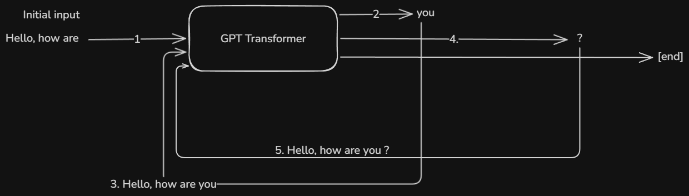

# Generative AI

## GPT

1. GPT stands for Generative Pre-Trained Transformer
   1. It is used simply to generate transformations for an input to a output based on the pre trained data or pre-trained conversions.
      1. Generative means to generate/create something
      2. Transformer means transforming an input to some output like converting/translating english input into hindi
      3. Pre-trained model on some data is used in this process
   2. Here, we use some neural networks that are trained on some data where we have some input and some output. The NN is fined tuned on the data and then it is used to convert new inputs into output based on the previously trained data
   3. GPT transformers are trained to predict the next word based on the input word sequence. They keep on predicting data until end of the sentence is not reached or full context of the input is not matched. The prediction is done on the pretrained data
      
2. Process of converting the input into output by GPT:
   1. Tokenization:
      1. The input sentence is divided into tokens
      2. The tokenization depends on model to model.
      3. The model divides the sentence into words that match with words present in their vocab
         1. Eg: gpt 4o converts the sentence "Hey whats up" into tokens: [25216, 55993, 869]
      4. Each token in the model vocab has a number associated with it. The same words will get same number
      5. The flow is: sentence --> vocab words --> numbers (tokens)
   2. Vector Embeddings
      1. A vector embedding is a list of numbers that represents the meaning of something (text, image, audio).
      2. Computers don’t understand meaning directly, but they are good with numbers. Embeddings convert things like words, sentences, images into numbers in such a way that similar things get similar numbers.
      3. Every word/sentence gets coordinates in a meaning-space, Similar meanings → close together, Different meanings → far apart
      4. Example with sentences:
         1. “I love dogs” and “Dogs are my favorite animals”. Their embeddings are very close
         2. “I love dogs” and “My car needs fuel”. Their embeddings are far apart
      5. The vector space is multidimensional and the vector embeddings provide the relative position of the input sentence in that space based on the similarities with other sentences. Each number in vector embedding is between -1 and 1, where -1 means opposite meaning, 0 means unrelated and 1 means very similar
      6. If 2 sentence have vector embeddings close to each other then it means they are similar
      7. Vector embeddings are numeric representations of meaning, where similar things are close together in a multi-dimensional space.
   3. Positional Encodings:
      1. It is just the vector encodings of a word/sentence along with its sequence number in the the given input.
      2. This is important so vector embeddings of 2 sentences like "cat like dog" and "dog like cat" does not came to be same as both the sentences have different meanings
   4. Attention:
      1. The Positional embeddings are then used to create multi head attentions
      2. Attention lets each word decide which other words matter most to it.
         1. Eg: “The animal didn’t cross the street because it was tired.” What does “it” refer to?. Attention helps the model figure that out.
      3. Single-head attention
         1. The model has one attention mechanism
         2. Each word looks at other words in one single
         3. Eg: “I went to the bank to deposit money” . Single-head attention might focus mainly on: “bank” ↔ “money”. But it can miss other relationships.
         4. Pros and cons
            1. ✅ Simple
            2. ❌ Limited perspective
            3. ❌ One focus only
         5. `Word → [Attention] → Context`
      4. Multi-head attention
         1. Instead of one attention, we have many heads.
         2. Each head learns to focus on different relationships
         3. Common transformer models use:
            1. 8 heads
            2. 12 heads
            3. 16 heads
         4. Eg: “The cat sat on the mat because it was soft.”
            1. Different heads might focus on:
               1. Head 1 → “it” ↔ “mat” (meaning)
               2. Head 2 → “cat” ↔ “sat” (grammar)
               3. Head 3 → “because” ↔ cause/effect
            2. Single-head attention can only do one of these
         5. ```
                Word → [Head1]
                     → [Head2]
                     → [Head3]
                     → Combine → Context
            ```
   5. Learning:
      1. During training, a Transformer learns by repeatedly:
         1. Taking an input sentence
         2. Using multi-head self-attention to decide which words should influence each other
         3. Making a prediction (next word, masked word, translation, etc.)
         4. Measuring error
         5. Updating attention weights so future predictions improve
      2. Multi-head attention is the core mechanism that lets the model learn relationships in the data.
